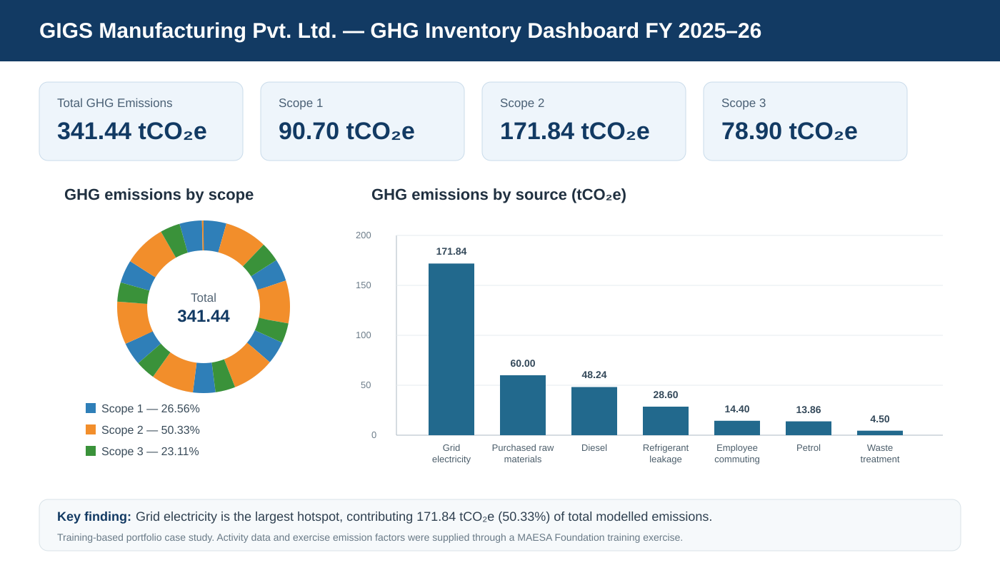

# Corporate Carbon Footprint & GHG Inventory
## GIGS Manufacturing Pvt. Ltd. | FY 2025–26

This is a **training-based sustainability portfolio case study** developed to demonstrate practical corporate GHG accounting, Excel analysis, emissions hotspot identification, dashboarding, and reduction planning.

> **Source transparency:** The activity data and exercise emission factors were provided through a **MAESA Foundation carbon-footprint training exercise**. The Excel calculation model, Scope classification, selected Scope 3 categorisation, hotspot analysis, dashboard, methodology documentation, and recommendations were developed as part of this portfolio project.

## Dashboard preview

## Project objective

The objective was to calculate and analyse the annual greenhouse gas footprint of a manufacturing company across:

- **Scope 1** — direct emissions
- **Scope 2** — purchased grid electricity
- **Selected Scope 3** — value-chain emissions

The case is documented in line with the **GHG Protocol Corporate Standard**.

## Reporting boundary

- **Reporting period:** FY 2025–26
- **Consolidation approach:** Operational control
- **Organisational boundary:** One manufacturing facility and one administrative office
- **Reporting unit:** tCO₂e

## Scope 3 categories included

- **Category 1:** Purchased Goods & Services
- **Category 5:** Waste Generated in Operations
- **Category 7:** Employee Commuting

## Calculation method

Emissions were calculated using:

**GHG emissions = Activity Data × Emission Factor**

Results were converted from kgCO₂e to tCO₂e.

The Excel workbook separates activity data from the emission-factor table and uses **XLOOKUP** to connect the datasets before calculating emissions.

## Results

| Scope | Emissions (tCO₂e) | Share of total |
|---|---:|---:|
| Scope 1 | 90.70 | 26.56% |
| Scope 2 | 171.84 | 50.33% |
| Scope 3 | 78.90 | 23.11% |
| **Total** | **341.44** | **100.00%** |

## Major emission sources

| Rank | Source | Emissions (tCO₂e) | Share of total |
|---:|---|---:|---:|
| 1 | Grid electricity | 171.84 | 50.33% |
| 2 | Purchased raw materials | 60.00 | 17.57% |
| 3 | Diesel | 48.24 | 14.13% |
| 4 | Refrigerant leakage | 28.60 | 8.38% |
| 5 | Employee commuting | 14.40 | 4.22% |
| 6 | Petrol | 13.86 | 4.06% |
| 7 | Waste treatment | 4.50 | 1.32% |

**Grid electricity is the largest hotspot**, contributing 50.33% of the modelled footprint.

## Key recommendations

- Reduce grid-electricity emissions through renewable electricity and energy-efficiency measures
- Reduce diesel consumption through improved generator efficiency and cleaner alternatives
- Improve refrigerant leak detection and consider lower-GWP refrigerants
- Engage suppliers and explore lower-carbon or recycled raw materials
- Encourage lower-carbon employee commuting options
- Improve waste segregation, recycling, and reuse

## Excel workbook structure

The workbook contains:

- `Activity_Data`
- `Emission_Factors`
- `GHG_Calculations`
- `GHG_Summary`
- `Dashboard`
- `Methodology`

## Project files

- [GHG Inventory Excel Workbook](./GIGS_GHG_Inventory_FY2025-26.xlsx)
- [Carbon Footprint Report PDF](./Ajay_Konda_Carbon_Footprint_Report_GIGS_Manufacturing_FY2025-26_pdf.pdf)
- [Dashboard Preview](./dashboard.svg)

## Skills demonstrated

- Corporate GHG accounting
- GHG Protocol concepts
- Scope 1, Scope 2, and selected Scope 3 analysis
- Emission-factor based calculations
- Excel XLOOKUP
- GHG inventory development
- Hotspot analysis
- Data visualisation and dashboarding
- Carbon-reduction recommendations
- Methodology, assumptions, and limitations documentation

## Assumptions and limitations

- Activity data and emission factors were supplied for the training exercise
- Scope 2 uses the supplied grid factor and a location-based calculation
- Only selected Scope 3 categories are included
- Supplier-specific emission factors were not available
- No independent assurance or verification was performed
- Results are intended for portfolio/training purposes and should not be treated as an assured corporate inventory

## Author

**Ajay Konda**  
Sustainability | ESG | Carbon Accounting
